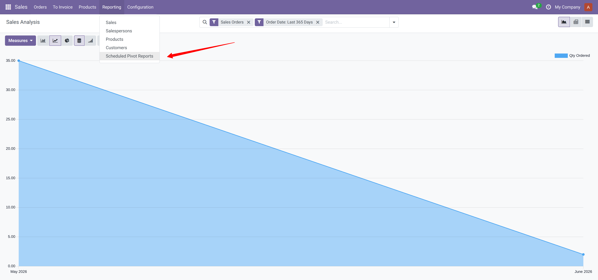
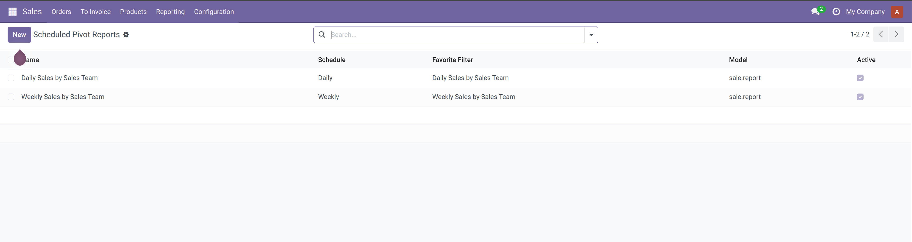
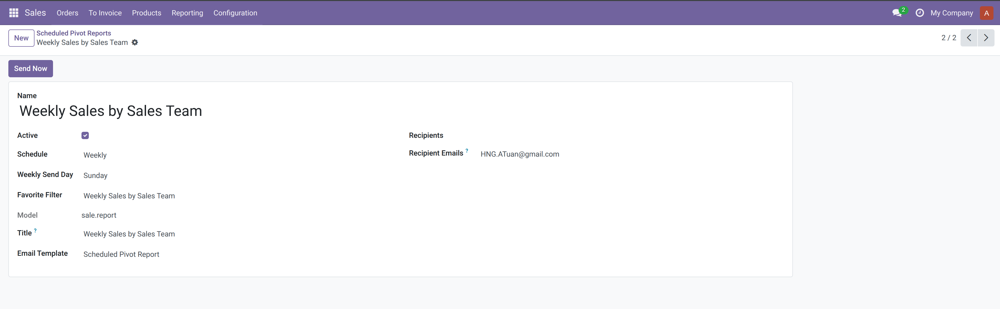

======================
Pivot Report Scheduler
======================

Schedule saved Odoo pivot reports and send them by email as XLSX
attachments.

This module lets users configure daily or weekly scheduled reports from
existing pivot favorites stored in ``ir.filters``. The scheduler reads the
favorite domain, row groupbys, column groupbys, and pivot measures, then builds
an XLSX file that follows Odoo's standard pivot export layout.

**Table of contents**

.. contents::
   :local:

Features
========

* Schedule daily and weekly pivot report emails.
* Reuse existing Odoo favorites from ``ir.filters``.
* Support row groupbys, column groupbys, and multiple measures.
* Preserve Odoo-style pivot totals for sum, count, average, and other aggregations.
* Send generated XLSX files to partners and extra email recipients.
* Use configurable ``mail.template`` records for email subject and body.

Installation
============

Make sure you have the ``xlsxwriter`` Python module installed:

::

   $ pip3 install xlsxwriter

Configuration
=============

Create or reuse an Odoo favorite from a pivot report. The favorite should
contain the pivot context keys used by Odoo, for example:

::

   {
       'pivot_row_groupby': ['date:day'],
       'pivot_column_groupby': ['team_id'],
       'pivot_measures': ['product_uom_qty'],
   }

Then create a scheduled pivot report and select:

* the favorite filter,
* the schedule, either daily or weekly,
* the recipients,
* the email template.

User Guide
==========

Menu View
---------

Open the scheduler from:

``Sales -> Reporting -> Scheduled Pivot Reports``

List View
---------

The list view shows all configured scheduled pivot reports. From here you can
see the report name, schedule, favorite filter, model, and active status.

Form View
---------

Use the form view to configure one scheduled report. Select the favorite
filter, schedule, recipients, and email template. Use the ``Send Now`` button
to test the report manually.

Workflow
--------

1. Create an ``ir.filters`` favorite from an Odoo pivot report.

   .. image:: static/description/favorite-ir-filter.png
      :alt: Create a pivot favorite filter
      :width: 100%

2. Create a scheduled pivot report and select the favorite filter from the
   previous step.

   .. image:: static/description/create-report.png
      :alt: Create a scheduled pivot report
      :width: 100%

3. Automatic sending: the daily and weekly cron jobs scan active scheduled
   pivot reports matching their schedule and send the emails automatically.

   .. image:: static/description/schedule-actions.png
      :alt: Daily and weekly scheduled actions
      :width: 100%

4. Manual sending: open a scheduled pivot report and click ``Send Now``.

5. Result: recipients receive an email with the generated XLSX report attached.

   .. image:: static/description/result.png
      :alt: Scheduled pivot report email result
      :width: 100%

Credits
=======

Authors
-------

* tuanhoangdef <hng.atuan@gmail.com>

Contributors
------------
